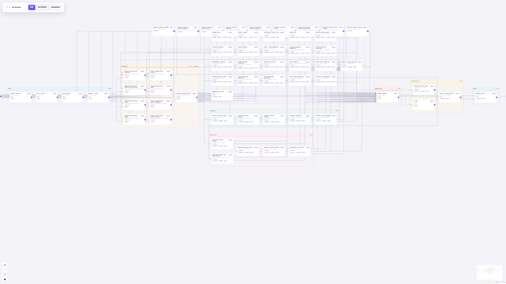
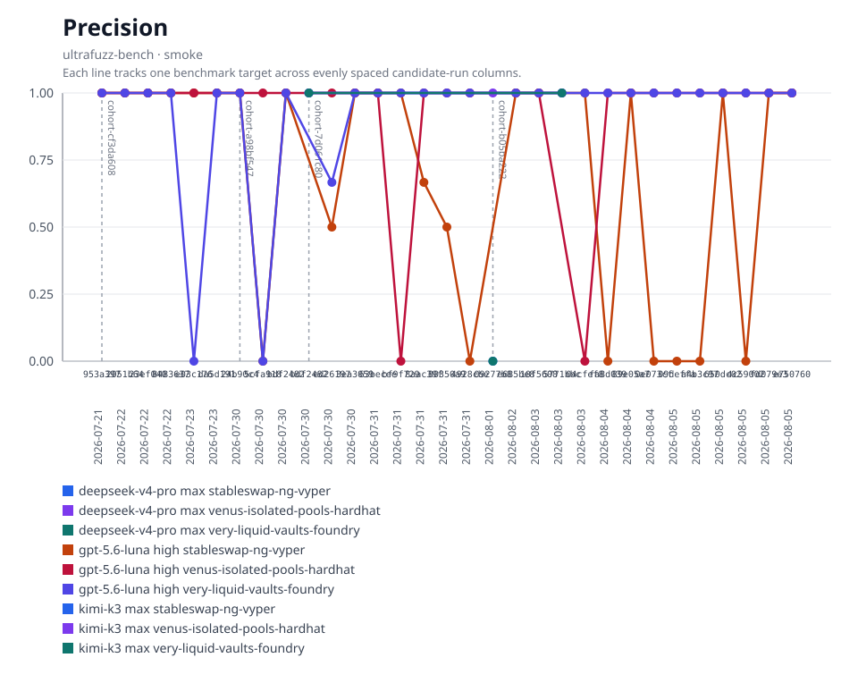
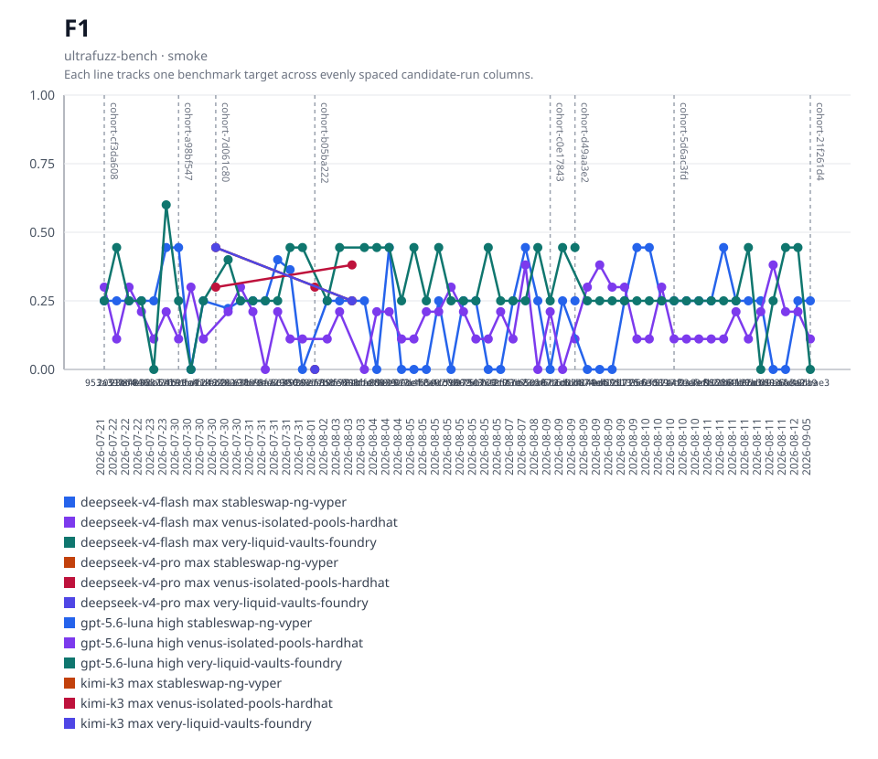
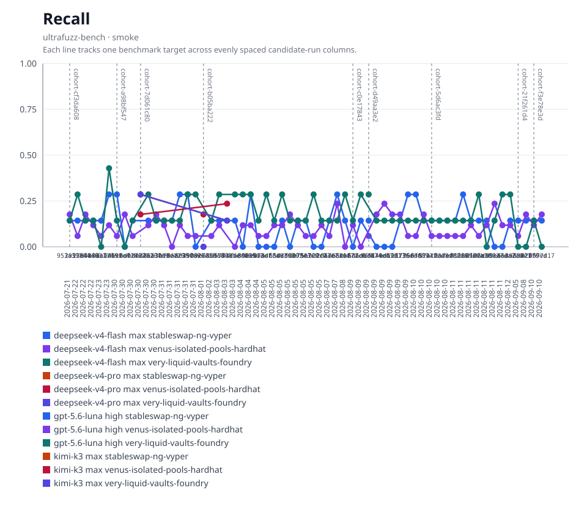
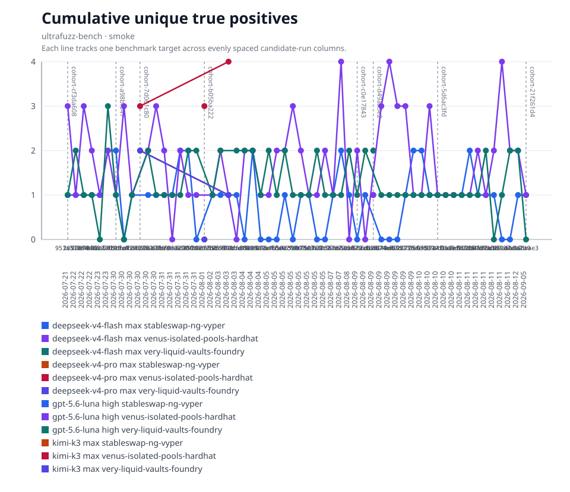
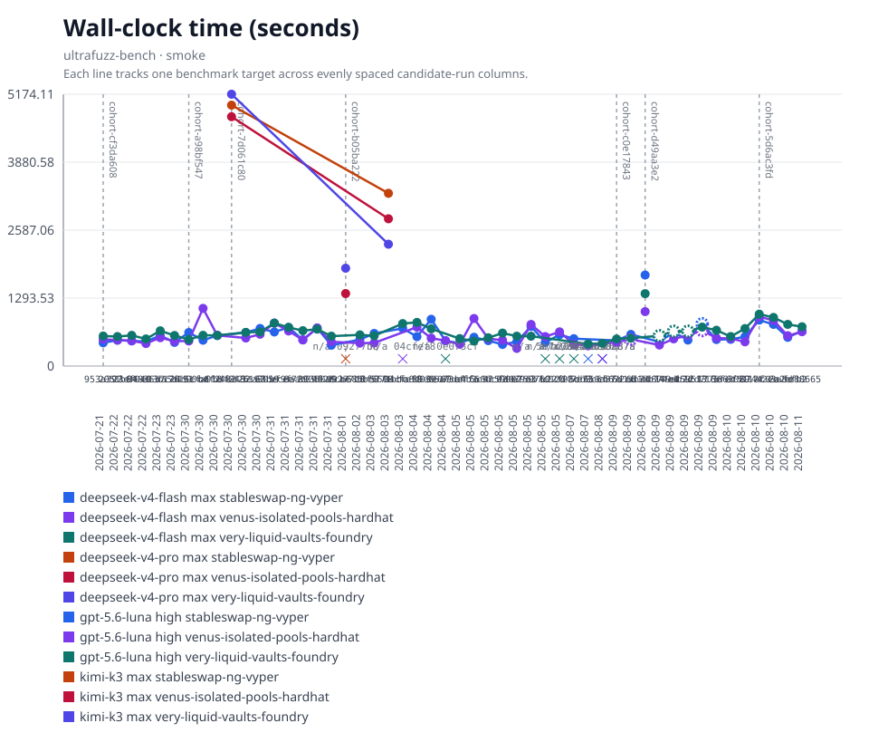
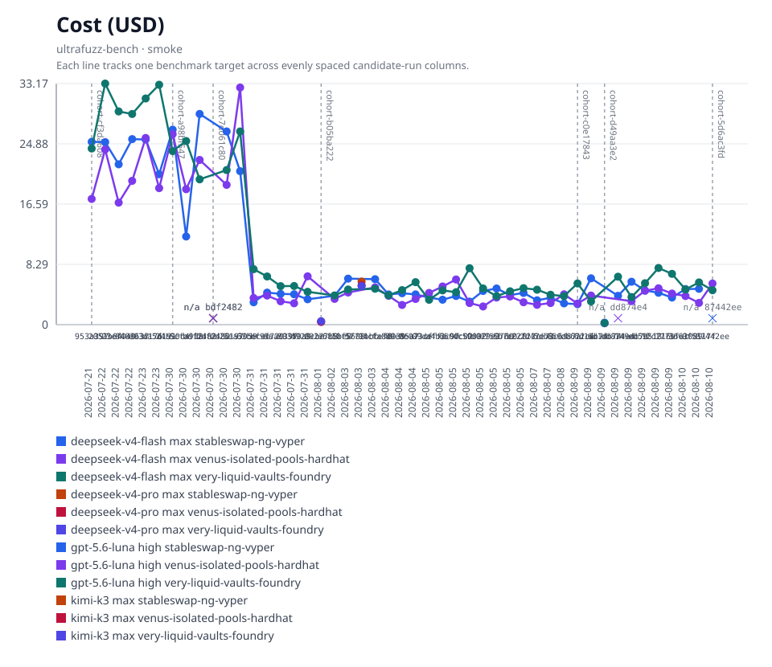

# Ultrafuzz


Ultrafuzz is an agentic orchestrator for smart contract fuzzing.



This tool initializes a protocol repository with editable prompts and topology, runs
specialized agents, collects generated fuzz tests and findings, and serves a
local dashboard plus final report for review.

> **Trust model:** Agents run in a trusted, skip-permissions workflow, and
> user-editable prompts can influence what is written into a target repository.
> Review the checked-in `.ultrafuzz/prompts/` before launching a campaign, and
> review generated artifacts before copying anything into your project. See
> [Security](docs/security.md) for details.

**Quality**





**Coverage**





**Efficiency**



**Spend**



## Operator Flow

1. `ultrafuzz init --project <project>`
   Creates root config plus project-owned topology, editable prompt copies,
   pinned references, run/cache/workspace directories, and workflow plumbing.
2. `ultrafuzz validate --project <project>`
   Validates config, topology, prompts, path guards, agent references, and the
   trust model. It does not execute agents.
3. `ultrafuzz references sync --project <project>`
   Explicitly fetches pinned property references into the local digest-checked
   cache. Normal runs stay offline and fail before launch when required
   references are not cached.
4. `ultrafuzz run --project <project>`
   Renders prompts, writes the product plan, launches the workflow, and stores
   run evidence under `.ultrafuzz/runs/**`.
5. `ultrafuzz ps`, `ultrafuzz status <run-id>`, and `ultrafuzz inspect <run-id>`
   Show product run evidence, concise health, and linked workflow status.
6. `ultrafuzz pause|resume|replay|fork <run-id>`
   Pause, resume, replay, or fork a linked run.
7. `ultrafuzz report <run-id>`
   Shows the agent-written final report artifact when the run has produced one.
8. `ultrafuzz materialize <run-id>` and `ultrafuzz clean <run-id>`
   Perform explicit, selected, path-safe filesystem operations. Agent limits
   around commits, pushes, pull requests, external submissions, staging, and
   merges are prompt instructions and trust-model assumptions, not a
   deterministic repository-mutation enforcement layer.

## Documentation

- [Start Here](docs/index.md)
- [Specification](docs/SPECS.md)
- [Tutorials](docs/tutorials/index.md)
- [How-To Guides](docs/how-to/index.md)
- [Reference](docs/reference/index.md)
- [Explanation](docs/explanation/index.md)
- [CLI](docs/cli.md)
- [Config](docs/config.md)
- [Eval Suites](docs/reference/evals.md)
- [EVMBench integration](benchmarks/evmbench/README.md)
- [Schemas](docs/schemas.md)
- [Security](docs/security.md)

## Development Checks

```bash
pnpm -w typecheck
pnpm --filter @ultrafuzz/runtime test
pnpm --filter @ultrafuzz/cli test
pnpm -w docs:check
```

Some package-local scripts build their direct workspace dependencies first
because workspace package exports point at `dist/**` entrypoints.
