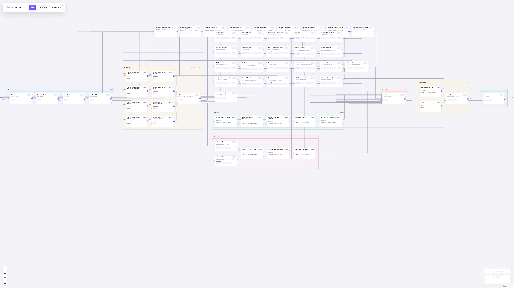

# Ultrafuzz


Ultrafuzz is an agentic orchestrator for smart contract fuzzing and threat hunting



This tool initializes a protocol repository with editable prompts and topology, runs
specialized agents, collects generated fuzz tests and findings, and serves a
local dashboard plus final report for review.

> **Security note**
>
> We strongly recommend running Ultrafuzz only on ephemeral, isolated virtual
> machines that can be safely discarded after use. Agents run in an
> unrestricted, skip-permissions workflow, which means they may unintentionally
> install or access dangerous tooling or sensitive credentials. Prompts, model
> choices, and target behavior can influence the actions agents take on the host
> and may result in unintended or destructive consequences. Do not run Ultrafuzz
> on a developer workstation, persistent environment, or any machine containing
> valuable data or credentials. Ultrafuzz is still under active development and
> has not necessarily undergone a complete security audit. Its implementation may
> contain unknown or undiscovered vulnerabilities.
>
> For campaigns, we recommend using a [published release](https://github.com/monad-developers/ultrafuzz/releases)
> that has been available for some time, for example at least seven days, rather
> than the `unstable` branch. Check out the release tag and review its source and
> prompts before installing dependencies or running Ultrafuzz.
>
> Review the checked-in `.ultrafuzz/prompts/` before launching a campaign. See
> [Security](docs/security.md) for the full posture.

## Getting started

Tell your agent:

```text
Your task is to launch an Ultrafuzz campaign on this project and make sure it
succeeds from start to finish.
Use a published Ultrafuzz release that has been available for some time, for
example at least seven days, rather than the unstable branch. Check out its tag
and tell me which release you selected.
Show me the available audit profiles and explain the tradeoffs. Recommend the
best fit for this target.
Before installing any dependencies, ask for my confirmation.
After the campaign starts, use the CLI to monitor its progress. Keep monitoring
until it finishes. If a node fails, for example because of a cyber-safety
refusal, resume the campaign from where it stopped.
```

## Documentation

- [Start Here](docs/index.md)
- [Specification](docs/SPECS.md)
- [Tutorials](docs/tutorials/index.md)
- [How-To Guides](docs/how-to/index.md)
- [Reference](docs/reference/index.md)
- [Prompt Catalog](docs/reference/prompt-catalog.md)
- [Explanation](docs/explanation/index.md)
- [CLI](docs/cli.md)
- [Config](docs/config.md)
- [Eval Suites](docs/reference/evals.md)
- [EVMBench integration](benchmarks/evmbench/README.md)
- [Schemas](docs/schemas.md)
- [Security](docs/security.md)
- [Reporting a vulnerability](SECURITY.md)
- [Licensing](docs/licensing.md)
- [Contributing](docs/contributing.md)
- [Code of Conduct](docs/CODE_OF_CONDUCT.md)

## License

Ultrafuzz is licensed under the [MIT License](LICENSE.md).
Copyright (c) 2026 Monad Foundation.
